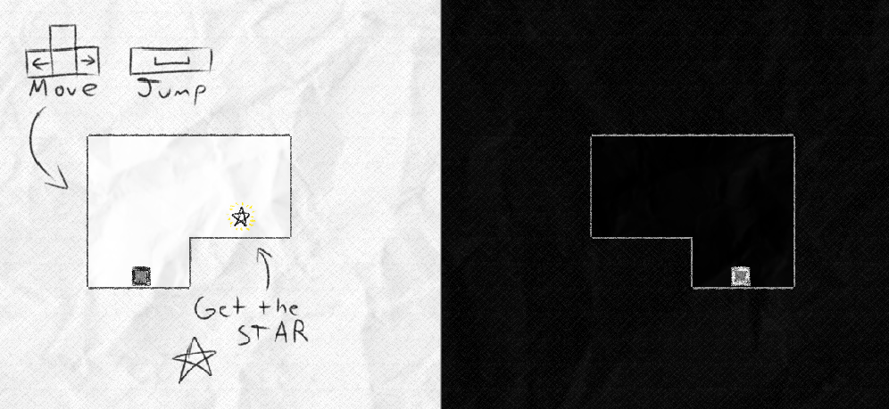

# Game Design Portfolio

## Table of Contents

- [About Me](#about-me)
- [Projects \& Accomplishments](#projects--accomplishments)
  - [Game Programming](#game-programming)
    - [**Hare:** Game Engine Creation. Early Proficiency with C++.](#hare-game-engine-creation-early-proficiency-with-c)
    - [**Mirror Game:** Game Jam Winner. Proficiency in Unity.](#mirror-game-game-jam-winner-proficiency-in-unity)
    - [**un»ruin:** Making Character Controllers. Proficiency in Godot.](#unruin-making-character-controllers-proficiency-in-godot)
  - [Other Skills](#other-skills)
    - [Narrative Design](#narrative-design)
    - [Music Composition](#music-composition)

## About Me

<!-- TODO: Complete. -->

Busy student studying game design. Looking to get busier. **Alaa Ramzi.**

Since high school, I held a strong passion for art through digital mediums. I am now a full-time college student at the University of New Haven, studying Computer Science with a concentration in Game Design.

As of the start of 2024, I am looking for opportunities to put my skills to use.

## Projects & Accomplishments

### Game Programming

#### **Mirror Game:** Game Jam Winner. Proficiency in Unity.

A simple puzzle game where you control two characters at the same time.

This game was made in under 48 hours, winning a local university held game jam.

[**(View more about "Mirror Game")**](./projects/mirror-game/mirror-game.md)

#### **Hare:** Game Engine Creation. Early Proficiency with C++.

A very, very basic 2D platformer game that's not about rabbits.

I get more in-depth about both the technology and the history behind this project than anything else listed here. To summarize, **I made a 2D game engine from scratch in under two months.**

[**(View more about "Hare")**](./projects/rabbit-game/rabbit-game.md)
