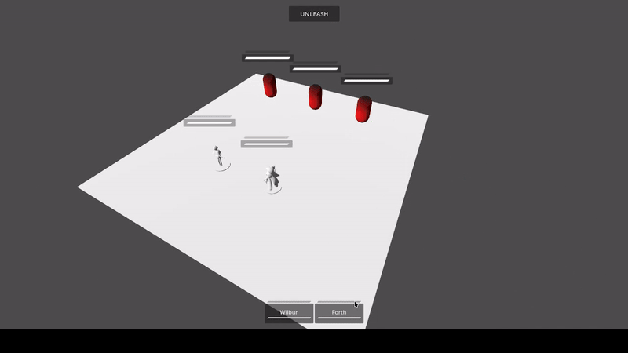

# Alaa Ramzi: Game Design Portfolio

## About Me

  https://www.credly.com/go/nwUYbkh5

## Current Work

### Sound Designer for Melessthanthree

Currently, I'm working as a sound designer, programmer, and assistant writer for a work-in-progress RPG game made by the creator of [Death of a Wish](https://store.steampowered.com/app/2302080/Death_of_a_Wish/) and [Luca: Born of a Dream](https://store.steampowered.com/app/896460/Lucah_Born_of_a_Dream/).

As of now, I have made dozens of sound effects for the game. Furthermore, I have implemented multiple systems to allow for a dynamic soundscape, including procedural level ambience.

You can find the SFX that I have made at the time of writing this in `sounds/mystery-game-rpg/`.

## Projects & Accomplishments

### **Pollution Patrol:** Made with PyGame.

A standalone game transforming mechanics from *Galaga* and *Breakout.*

View the source code in `projects/pollution-patrol/`

[**PLAY IT HERE**](https://ramzialaa.github.io/projects/pollution-patrol/)

### **Mirror Game:** Game Jam Winner. Proficiency in Unity.

A simple puzzle game where you control two characters at the same time.

This game was made in under 48 hours, winning a local university held game jam.

[**(View more about "Mirror Game")**](./projects/mirror-game/mirror-game.md)

### **Eclimp:** Prototype Turn-based Combat Game.

Eclimp is a prototype of a 3D turn-based strategy game that I am making in Godot. It is my most current and well-made project so far.

[**(View more about "Eclimp")**](./projects/eclimp/eclimp.md)

### **Hare:** Game Engine Creation.

A basic 2D platformer game. Made using SDL2 for graphics. The game is made from scratch, using C++.

[**(View more about "Hare")**](./projects/rabbit-game/rabbit-game.md)
