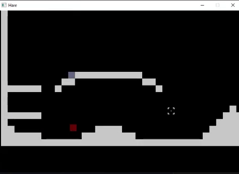

# Alaa Ramzi: Game Design Portfolio

## About Me

  https://www.credly.com/go/nwUYbkh5

Busy student studying game design. Looking to get busier.

Since high school, I held a strong passion for art through digital mediums. I am now a full-time college student at the University of New Haven, studying Computer Science with a concentration in Game Design.

As of the start of 2024, I am looking for opportunities to put my skills to use.

## Projects & Accomplishments

### Game Programming

#### **Pollution Patrol:** Made with PyGame.

A standalone game transforming mechanics from *Galaga* and *Breakout.*

#### **Mirror Game:** Game Jam Winner. Proficiency in Unity.

A simple puzzle game where you control two characters at the same time.

This game was made in under 48 hours, winning a local university held game jam.

[**(View more about "Mirror Game")**](./projects/mirror-game/mirror-game.md)

#### **Eclimp:** Prototype Turn-based Combat Game.

Eclimp is a prototype of a 3D turn-based strategy game that I am making in Godot. It is my most current and well-made project so far.

[**(View more about "Eclimp")**](./projects/eclimp/eclimp.md)

#### **Hare:** Game Engine Creation.

A basic 2D platformer game. Made using SDL2 for graphics. The game is made from scratch, using C++.

[**(View more about "Hare")**](./projects/rabbit-game/rabbit-game.md)
