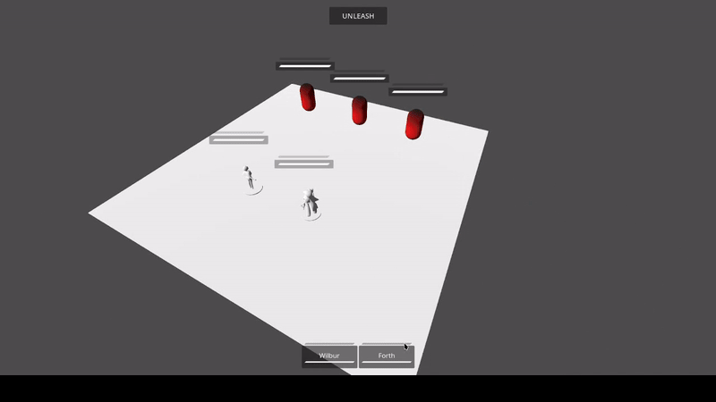
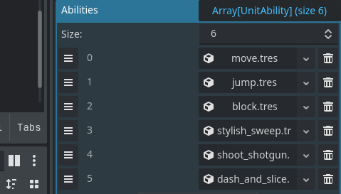
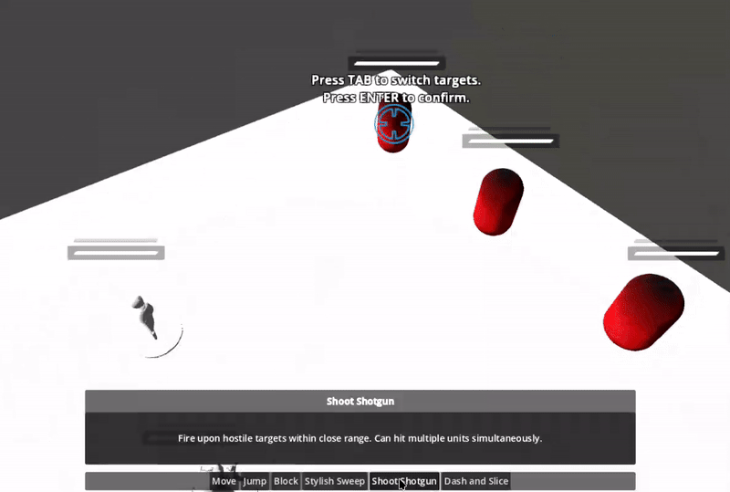
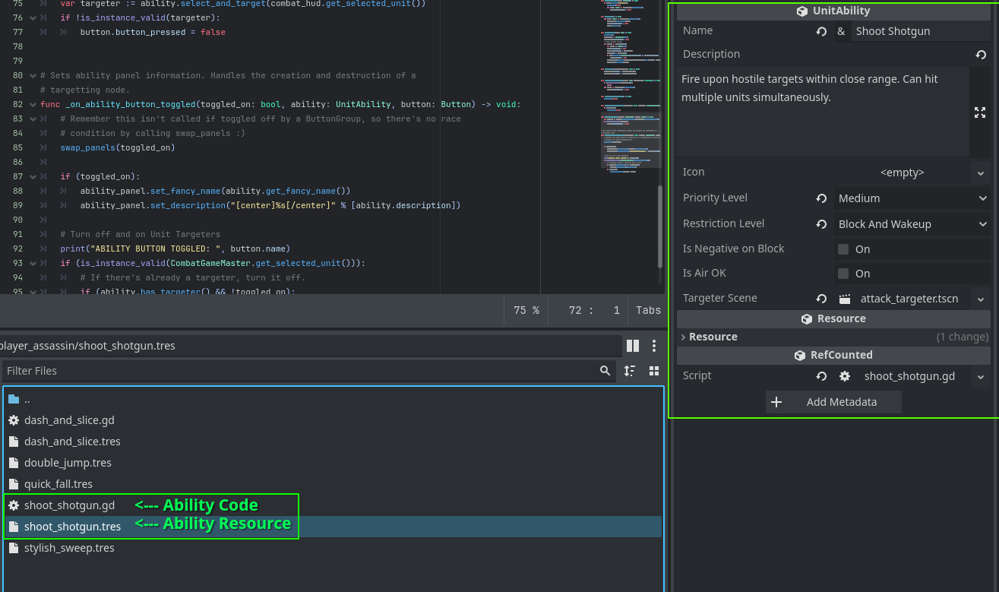
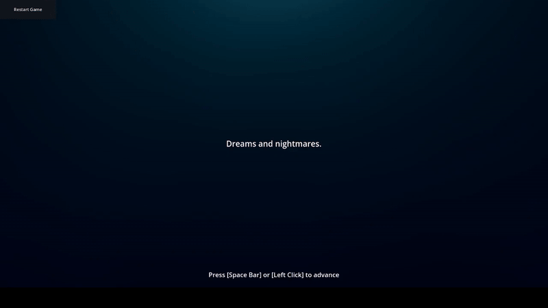

# Eclimp

Eclimp is the code-word for a project I made for my narrative game design course. Currently, it is a role-playing game with a heavy focus on turn based fighting mechanics.

## Basic Programming Structure

Eclimp uses two languages to preform its duties, GDScript and C++ (using GDExtension). Furthermore, C++ handles class definition and processing intensive tasks while GDScript defines most game logic and [resources.](#using-resources-godot-equivalent-of-unitys-scriptableobjects)

## Using "Resources" (Godot Equivalent of Unity's ScriptableObjects)

In Godot, resources are data containers that are used by nodes (equivalent to GameObjects in Unity) that can be saved on disk.

The project relies mostly on composition rather than inheritance. Resources are essential for Eclimp to maintain good composition practice. This allows for quicker development and less programming with equal results.

## How Gameplay Is Designed & Coded

The play area of Eclimp is primarily made up of the following components:

- CombatBoard: A container for units. Handles turn rotation and manages all units.
- Unit: An entity on the CombatBoard. Can be controlled by the player.
  - UnitAI: A resource that determines autonomy of a unit.
  - UnitAbility: An action a unit can preform. A single unit can have multiple abilities.
- CombatGameMaster: An intermediary that determines how the player interacts with a unit (eg. unit selection)
- CombatHUD: The UI for the game during play.
<!-- - CombatCameraController: Moves the player camera. Can focus on specific locations.
- CombatCamera: Handles raycasting with the camera. Main camera for the scene. -->

The most important nodes for gameplay are Unit and it's components.

### UnitAbility

Unit abilities define the actions of what a unit can do. Being resources, they can be used by any unit in the game. They can be added to an array exposed by Godot's inspector as shown here:

One of these abilities is "Shoot Shotgun," used by one of the playable units. The player can use the ability by **selecting the appropriate unit, choosing the "Shoot Shotgun" option below, and confirming the action by selecting a target.**

To define the "Shoot Shotgun" ability, the UnitAbility was saved in the project while containing information for the UI and the game logic.

<!-- ## Integrating Narrative

A narrative system has been worked on the game as well. I had made a dialogue system from scratch to implement it. -->