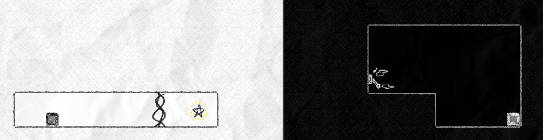

# Mirror Game

> [**(You can try Mirror Game on Itch.io)**](https://woodensponge.itch.io/mirror-game)
>
> 

## Creation Process

Mirror Game is a simple game that was created in Unity in an entire weekend. I created all the assets, visual or auditory (except for the joke video when the game ends.) All the art, music, and sounds were made with [*Tiled,*](https://www.mapeditor.org/) [*REAPER,*](https://www.reaper.fm/) and [*Clip Studio Paint.*](https://www.clipstudio.net/en/)

The awards ceremony was held in a Discord voice channel. The winners were declared in voice, and I was awarded a winning position in "creativity and technical complexity."

### The Premise

"Your own worst enemy" was the theme for the game jam. Having wanted to make a puzzle game for the jam, I had decided to make a game where you control the same player in different levels at once.

### Technology Behind Mirror Game

The player is able to control two versions of their character: a box that can move left and right with the ability to jump. The black version of the character is the "main version" while the other has inverted controls. This was made possible by simply creating two rooms for the characters. The two characters used the same code, while the white version had an "inverted" flag set.

This design led to asymmetrical level design later in the game, as shown here:

In this level, the player can only reach the star (which takes them to the next level) by flipping the lever with the other character. This is the simplest demonstration of this game's design, and shows why this game won its position as the "most technically complex."