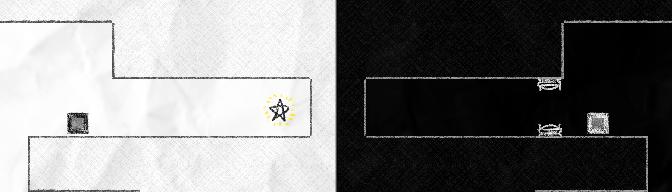

# Mirror Game

> [**(You can get Mirror Game on Itch.io)**](https://woodensponge.itch.io/mirror-game)

## Creation Process

Mirror Game was created in Unity in an entire weekend. I created all the assets, visual or auditory (except for the joke video when the game ends.) All the art, music, and sounds were made *very quickly* with [*Tiled,*](https://www.mapeditor.org/) [*REAPER,*](https://www.reaper.fm/) and [*Clip Studio Paint.*](https://www.clipstudio.net/en/)

The awards ceremony was held in a Discord voice channel. The winners were declared in voice, and I was awarded a winning position in "creativity and technical complexity."

### The Premise

"Your own worst enemy" was the theme for the game jam. Having wanted to make a puzzle game for the jam, I had decided to make a game where you control the same player in different levels at once.

## Game Summary

### The First Room

The goal of the game of Mirror Game is to **obtain the star.**

The controls of the game are simple, you press either the left or right arrow key to move in their respective direction. You press the space bar to jump, and you press the E key to use objects. The player **cannot** progress unless they're aware of all the controls, using them as displayed above them.

The last thing the player is aware of is their inverted counterpart:

I had asked my father to play this game for me, and I refused to help him with anything. Watching him actually learn how to play the game was entertaining, but immensely satisfying when he managed to beat the game. I considered this room a success.

### The Second Room

This room was an attempt to show how the mirrored counterpart affects the players progress.

The mirrored player, beside a movement detector, will block the player from moving forward if it moves past it.

In order to progress, the player will have no choice but to approach the lever, trapping their mirrored counterpart and allowing them to reach the star.

### What Should've Been the Second Room

After obtaining the [second room's](#the-second-room) star, the player is placed in the following level:

Between the player and the star is a force field, not allowing the player to obtain it. In order to progress, the player must control their mirrored counterpart, switching the lever in order to pass.

In hindsight, this room should've been the second one. It properly introduces how the mirrored counterpart should be something to pay attention to during puzzles.

### The Final Room

You push a box off a pressure plate, and then you win the game.

