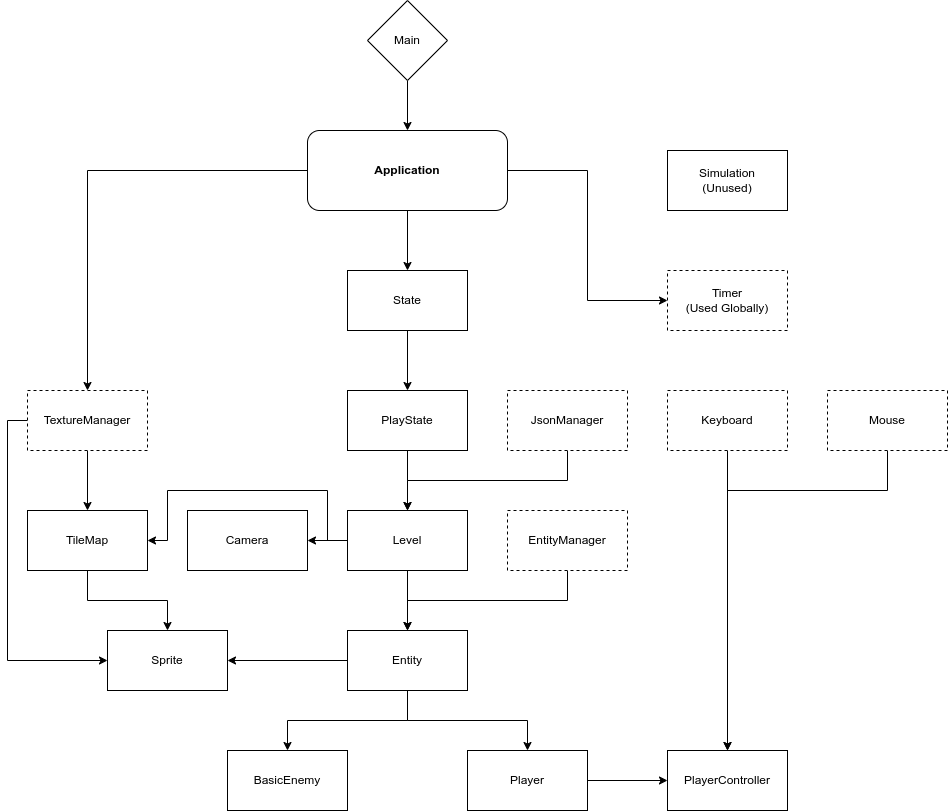

# Hare

[View the repository here](https://github.com/Woodensponge/Hare-Senior-Project)

Hare was my senior project back in high school. It's a game where you move a square in a level. There's no goal, but you can have fun moving very fast.

As for the *engine* it's running on, it's *completely made from the ground up.* It uses [SDL2](https://www.libsdl.org/) as a rendering engine, but that's about it when it comes to third-party libraries.

## Original Premise

Hare was supposed to be a 2D action game with destructive environments powered by cellular-automata. The game engine it was made with was made from the ground up within 2 months.

## The Engine

At a glance, the *Hare Engine* has the following capabilities:

- Sprite Rendering
- World Simulation
  - Frame based updating. (Mostly for rendering.)
  - Tick based updating. (Mostly for physics and game logic.)
  - State machine for application handling.
- Collision
- Input Handling

The entire project was made in C++. Being a high school student at the time, I had learned the following lessons about making anything with such a language:

- Check for memory leaks.
- Have every class serve a purpose.
- Don't have multiple classes serve a similar purpose.

## Structure of The Engine

Below is a general overview of the structure of the engine. Static classes are outlined with dashes:



Every class below `PlayState` is used for game logic. `PlayState` requires `TextureManager` to render its sprites, `TextureManager` needs `Application`, etc.

## Physics and the Player Controller

`PlayerController` preforms as its name suggests. It handles pushing the `Player` class around.

`Entity`, and `Player` by extension, handles the physics and collision every game tick.

```cpp
// virtual Entity::Update()

if (health < 0)								//If the entities health is 0...
    this->Die();							//Kill the entity.

//Speed calculations and conditions
if (isGrounded)
{
    if (speed > 0)
        speed -= abs(speed / 8);
    else if (speed < 0)
        speed += abs(speed / 8);
}

if (!isGrounded)
{
    if (speed > 0)
        speed -= abs(speed / 16);
    else if (speed < 0)
        speed += abs(speed / 16);
}

if (this->isAffectedByGravity)
{
    //Gravity calculations and conditions
    gravity += 1;

    if (gravity > 100)
        gravity = 100;
    else if (gravity < -100)
        gravity = -100;
}

pos.x += speed;
pos.y += gravity;

UpdateHitbox();

if (entityFlags & ENTITYSTATE_DEAD)			//If the entity is dead...
    return;									//Don't run the rest of the method.
```
