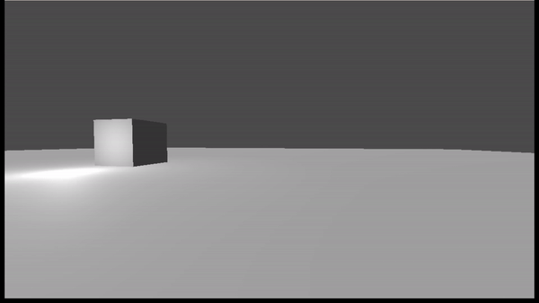

# un»ruin

> You can find the full code for the project in `/projects/unruin/cpp-code/`

*un»ruin* is a very early project I'm working on, running in the Godot engine. A majority of the code is written in C++ (via GDExtension) rather than GDScript or C#. Unlike the latter languages, coding a Godot game in C++ requires much more experience with both the language and the engine itself.