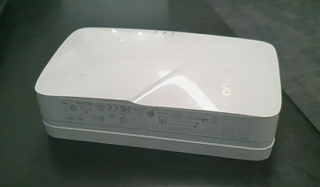
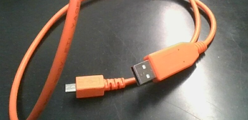
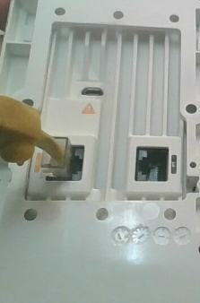
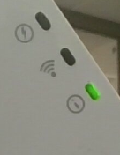
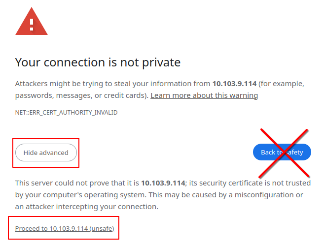
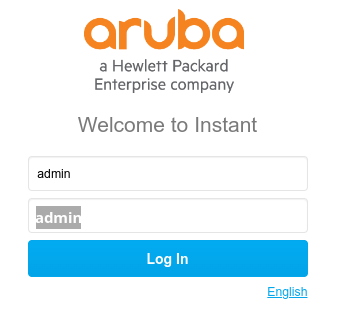
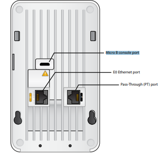
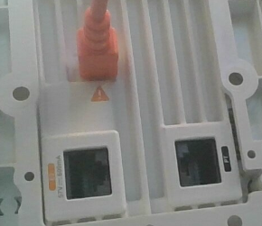
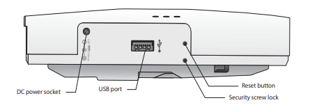
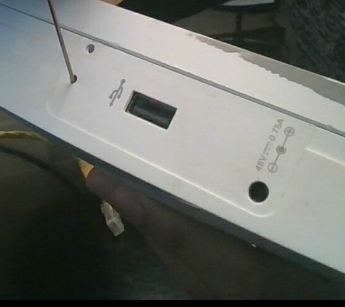

# AP Setup Procedure

## Needed Materials

The following is essential for use and setup:

- An Aruba AP
- A desktop computer
- An Ethernet cable that supports PoE (Power over Ethernet)

Your AP should look like this:



### Aruba Console Cable

You should also have an Aruba console cable on standby in case you need to [access its serial console.](#accessing-the-console)



## Powering the Device

The AP requires a PoE Ethernet cable to power on. You should have been given access to an Ethernet cable with PoE capability.

Plug the PoE Ethernet cable into the AP's E0 Ethernet Port, as shown here:

| |  |
|---|---|
| <center>Diagram | <center>Picture |

If the AP is successfully connected to power, the LED on the top of the AP should light up green:



If the AP is **not** powering on, [it's an issue that can be (hopefully) easily resolved.](#the-ap-isnt-powering-on)

## Interfacing With the AP

### Accessing WebUI

The most straightforward method to access the AP's WebUI is to find its IP address. This can be done by [accessing the console](#accessing-the-console), [logging in](#first-login), and using a desktop machine that's within the same network as the AP.

On your desktop machine, open your browser and enter the following within the search bar:

```
https://XXX.XXX.XXX.XXX:443
```

`XXX.XXX.XXX.XXX` should be replaced by the proper IP address for the AP (br0). Remember to ensure that your desktop PC is on the same network as the AP. On Windows (and MacOS), you can check by opening the command prompt (or terminal) and entering the command `ipconfig`. On Linux, use `ip addr`.

Furthermore, you **must** use the **HTTPS** protocol, or you won't be able to find a connection.

> | 🛈 Info |
> |---|
> | <p>When attempting to access the WebUI for the first time on your desktop, your browser may warn you that the "connection is insecure."</p><p>Ignore it and proceed. Click on the "Advanced" button and then "Proceed Anyway." You may have to do this twice or three times.</p>

When successful, you should be able to see the login screen right in front of you. Assuming you haven't changed the default account's username or password, you can just enter the following into the screen:

```
Username: admin
Password: admin
```



Upon successful login, you will be greeted with the dashboard. You now have access to the WebUI.

### Accessing the Console

> | 🛈 Info |
> |---|
> | This section assumes you're using Microsoft Windows to interface with the AP |

#### Physical Connections

If you're in possession of an [Aruba console cable](#aruba-console-cable), you can access its console through your desktop machine using PuTTY.

First, connect the console cable to the console port, the one next to the yellow warning sign (⚠️):

| |  |
|---|---|
|<center>Diagram|<center>Picture|

> | ⚠️ Caution |
> |---|
> | The warning sign is there for a reason. Don't stick some typical micro-usb cable in it. It won't work and may cause physical damage to the AP. |

After the appropriate cable is connected to the AP, connect the USB end to your desktop computer. It should automatically recognize it as a COM device.

#### Checking the COM Port Number

To check the name of the COM port, press [Windows Key+R] to open the run window. Type `devmgmt.msc` and hit [Enter].

The device manager should pop up. When it does, click `Ports (COM & LPT)` and find a device that says `USB Serial Port (COM#)` where the `#` is some random number.

```
...
Network Adapters
Other Devices
Ports (COM & LPT)
    Intel(R) Active Management Technology - SOL (COM5)
    USB Serial Port (COM#) <--
Print queues
Processers
SD host adapters
...
```

With the number for your COM port known, launch PuTTY. For your connection type, click on `Serial`. The **Serial line** field should appear. Enter `COM1` into the field before pressing [Enter] to connect to your AP's console.

#### Actual Interfacing and Refreshing the Console

A command line window should appear now. If the AP has already booted, press [Enter] in the window to see if `User:` appears. If the AP is in the middle of booting (the LED light is blinking), then text should appear on the screen by itself.

You now have access to the AP's console.

## First Setup (From Factory State)

Setting up the AP requires it to be [powered on](#powering-the-device) and properly [interfaced with the console.](#accessing-the-console)
> | 🛈 Info |
> |---|
> | This section details the first setup of an AP after a [factory reset,](#factory-reset) **not** for accessing an AP during a standard lab session. |

### First Login

[Interface with the console](#accessing-the-console) and [refresh the command line](#actual-interfacing-and-refreshing-the-console) to begin logging into the console. Your screen should look something like this:

```
User:
```

To log into the console, you will need to input the default username and the password.

| Default Username | Default Password          |
|------------------|---------------------------|
| admin            | admin                     |

Now enter `admin` as your username and `admin` as your password. You should now be logged in. A successful login shows the following command line (`xx:xx:xx:xx:xx:xx` is your AP's mac address.):

```
User: admin
Password:

show tech-support and show tech-support supplemental are the two most useful outputs to collect for any kind of troubleshooting session.

xx:xx:xx:xx:xx:xx#
```

## Troubleshooting

<!-- ### Can't Connect to the AP

Check if your AP is [powered on](#powering-the-device) and connected to the appropriate PoE Ethernet cable. If not, [that's its own problem.](#the-ap-isnt-powering-on) -->

### The AP Isn't Powering On

If you LED of the AP isn't on, make sure that the cable is connected to the appropriate port as [previously practiced.](#powering-the-device)

If it's still not powering on **and your cable is connected to the appropriate port,** your Ethernet cable may not be connected to a PoE switch. Contact your instructor or borrow another PoE Ethernet cable somewhere else.

### The AP Keeps Looping Over and Over Again

Not much can be done about this other than to [factory reset it.](#factory-reset)

### Factory Reset

Before preforming a factory reset on your AP, you will need a paperclip and a PoE Ethernet cable. The AP **must** be receiving power during the factory reset.

> | ⚠️ Caution |
> |---|
> | You must acknowledge that everything is going to be wiped during this. SSIDs, work a student has made, *everything.* Don't preform a factory reset unless you want to lose your work. All configuration prior will have to be redone as well. This isn't a neat option for wiping a slate clean after a class. |

To preform a factory reset, obtain your paperclip and find the reset button for your AP, as shown in this diagram:



Once you have located the reset button, make sure the AP is **powered off** and the PoE Ethernet cable is disconnected.

Next, firmly insert your paperclip into the reset button until you feel a small click:



Once the paperclip is inside and pushing the button, [power it on](#powering-the-device) and continue to push the button until the LED in the front begins to blink within 5 seconds. Release the push button, the AP should begin and succeed in its factory reset.


> | 🛈 Info |
> |---|
> | [Connecting the AP to a console](#accessing-the-console) would help tell you if it has begun a factory reset. When you see `**** Configuration Reset Requested by User ****`, that means it worked. |

<!-- SSIDs: Aruba233-A/Aruba233-B -->
