# Lab: Initial configuration / Factory Reset with One SSID

> | 🛈 Info |
> |---|
> | **If you're ever having trouble, please refer to the [Troubleshooting](#troubleshooting) section before asking for assistance.**|

## Objective

To learn how to factory reset, access, and configure an Aruba Access Point.

## Expected Time to Complete

About 15-20 minutes. The AP will take some time to boot, especially during and after a factory reset.

## Needed Materials

The following is essential for use and setup:

- An Aruba AP
- A desktop computer
- An Ethernet cable that supports PoE (Power over Ethernet)
- A paper clip, pin, needle, or any other slender object

Your AP should look like this:


### Aruba Console Cable

You should also have an Aruba console cable on standby when you need to [access its serial console.](#step-2-connecting-to-putty)


## **STEP 1:** Powering the Access Point

The AP requires a PoE Ethernet cable to power on. You should have been given access to an Ethernet cable with PoE capability.

Plug the PoE Ethernet cable into the AP's E0 Ethernet Port, as shown here:

| |  |
|---|---|
| <center>Diagram | <center>Picture |

If the AP is successfully connected to power, the LED on the top of the AP should light up green:


If the AP is **not** powering on, [it's an issue that can be (hopefully) easily resolved.](#the-ap-isnt-powering-on)

## **STEP 2:** Connecting to PuTTY

You will need to access the AP's console in order to obtain the following information:

- Concrete confirmation of a successful factory reset.
- Getting the AP's IP address in step 3.

> | 🛈 Info |
> |---|
> | This section assumes you're using Microsoft Windows to interface with the AP. |

### Physical Connections

If you're in possession of an [Aruba console cable](#aruba-console-cable), you can access its console through your desktop machine using PuTTY.

First, connect the console cable to the console port, the one next to the yellow warning sign (⚠️):

| |  |
|---|---|
|<center>Diagram|<center>Picture|

> | ⚠️ Caution |
> |---|
> | The warning sign is there for a reason. **Don't stick some typical micro-usb cable in it.** It won't work and may cause physical damage to the AP. |

After the appropriate cable is connected to the AP, connect the USB end to your desktop computer. It should automatically recognize it as a COM device.

#### Checking the COM Port Number

To check the name of the COM port, press [Windows Key+R] to open the run window. Type `devmgmt.msc` and hit [Enter].

The device manager should pop up. When it does, click `Ports (COM & LPT)` and find a device that says `Silicon Labs CP210x USB to UART Bridge (COM#)` where the `#` is some random number.

```
...
Network Adapters
Other Devices
Ports (COM & LPT)
    Intel(R) Active Management Technology - SOL (COM#)
    USB Serial Port (COM#)
    Silicon Labs CP210x USB to UART Bridge (COM#)       <---
Print queues
Processers
SD host adapters
...
```

With the number for your COM port known, launch PuTTY. For your connection type, click on `Serial`. The **Serial line** field should appear. Enter `COM1` into the field before pressing [Enter] to connect to your AP's console.

#### Actual Interfacing and Refreshing the Console

A command line window should appear now. If the AP has already booted, press [Enter] in the window to see if `User:` appears. If the AP is in the middle of booting (the LED light is blinking), then text should appear on the screen by itself.

You now have access to the AP's console.

## **STEP 3:** Factory Reset

Before preforming a factory reset on your AP, you will need a paperclip and a PoE Ethernet cable.

To make this process much easier, [establish a PuTTY connection] and watch the terminal.

> | ⚠️ Caution |
> |---|
> | Only preform a factory reset during this lab. If you're having trouble with the AP in the next labs, go to the professor. **Do not** factory reset the AP unless you want to waste time reconfiguring it again. |

1. To preform a factory reset, unplug the PoE ethernet cable. **THE SYSTEM MUST BE POWERED OFF.**
2. Obtain your paperclip and find the reset button for your AP. The button is the only hole **directly** underneath the USB port, as shown in this diagram:<br>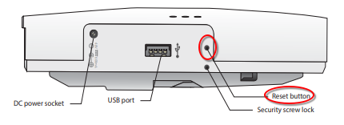
3. Ensure the system is still powered off. Next, firmly insert your paperclip into the reset button until you feel a small click:<br>
4. Once the paperclip is inside and pushing the button, [power it on](#powering-the-device) with the PoE cable. **DO NOT LET GO OF THE PAPERCLIP. KEEP PUSHING THE BUTTON.** Continue to push the button until the LED in the front begins to blink within 5 seconds. Release the push button, the AP should begin and succeed in its factory reset.
5. Watch the PuTTY window **until** you see a message pop up saying `**** Configuration Reset Requested by User ****`. If you see it, the factory reset worked successfully. If you didn't, repeat this process. If you cannot see it, ask the instructor for help.

> 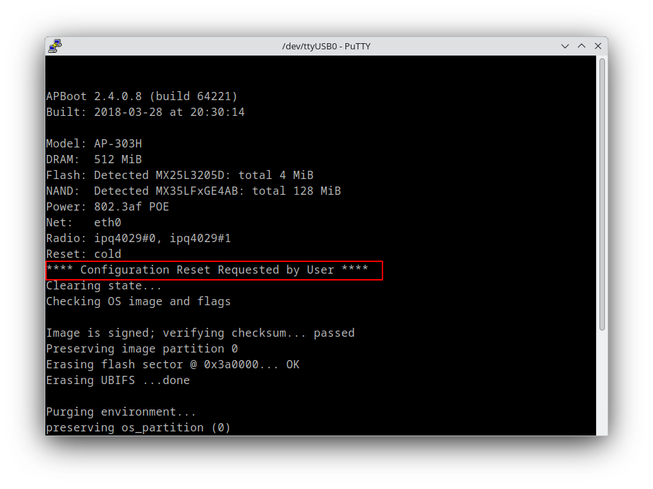

<!-- SSIDs: Aruba233-A/Aruba233-B -->

## **STEP 4:** Finding the AP's IP Address

> | 🛈 Info |
> |---|
> | Make sure you have completed [step 2](#step-2-connecting-to-putty) properly for this step. Your connection to the AP's console should be stable. |

Your AP should be properly booted up now. You should now see the following message on successful boot:

```
<<<<<      Welcome to the Access Point      >>>>>
```

If you do not see this message, your AP is either:
- Still in the process of booting.
- **Has already booted** and is spitting out system notifications.

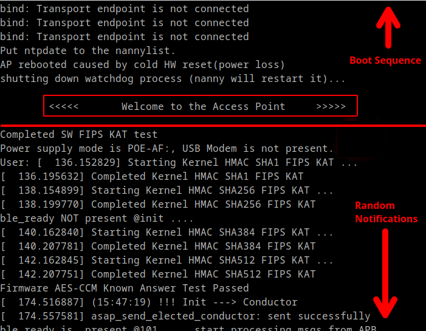

The login prompt will **not** appear unless you hit **\[Enter\].**

Go back to your PuTTY console and press after the AP booted **\[Enter\].** The console should show the user prompt when you do:

```
User:
```

> | 🛈 Info |
> |---|
> | If pressing **\[Enter\]** doesn't show anything, your AP is either in the middle of booting or needs **rebooting.** Check back after about 2 minutes. If you're still not getting a response, unplug and replug the PoE cable into the AP. Ensure your console cable is connected properly and review [step 2.](#step-2-connecting-to-putty) |

To log into the console, you will need to input the default username and password.

| Default Username | Default Password          |
|------------------|---------------------------|
| admin            | (Your AP's Serial Number) |

Upon successful login, you will be prompted to change the password. Please enter `password` (case-sensitive) and continue. You should now see the following prompt. (`XX:XX:XX:XX:XX:XX` is your AP's MAC address):

```
User: admin
Password:

show tech-support and show tech-support supplemental are the two most useful outputs to collect for any kind of troubleshooting session.

XX:XX:XX:XX:XX:XX#
```

> | 🛈 Info |
> |---|
> | If you're unlucky, your AP might spit out the line `Internal error 8-0` instead. See [Troubleshooting](#internal-error-8-0-please-contact-support) for what you can do to fix it. |

To find the IP address from here, input the command `show ip interface brief`. Your IP address should be the one from `br0` interface.

```
XX:XX:XX:XX:XX:XX# show ip interface brief
Interface                         IP Address / IP Netmask       Admin  Protocol
br0                              10.103.X.XX / 255.255.252.0    up     up
br0.3333                         172.31.98.1 / 255.255.254.0    up     up
XX:XX:XX:XX:XX:XX#
```

## **STEP 5:** Accessing the AP's WebUI

Ensure you have the IP from [step 4.](#step-4-finding-the-aps-ip-address)

On your desktop machine, open your browser and enter the following within the search bar. `XXX.XXX.XXX.XXX` should be replaced by the proper IP address for the AP (br0):

```
XXX.XXX.XXX.XXX

or

https://XXX.XXX.XXX.XXX:443
```
You **must** use the **HTTPS** protocol, or you won't be able to find a connection.

> | 🛈 Info |
> |---|
> | When attempting to access the WebUI for the first time on your desktop, your browser may warn you that the "connection is insecure."</p><p>Ignore it and proceed. Click on the "Advanced" button and then "Proceed Anyway." You may have to do this twice or three times.<br>

> | 🛈 Info |
> |---|
> | Remember to ensure that your desktop PC is on the same network as the AP. On Windows (and MacOS), you can check by opening the command prompt (or terminal) and entering the command `ipconfig`. On Linux, use `ip addr`. |

When successful, you should be able to see the login screen right in front of you. Assuming you haven't changed the default account's username or password, you can just enter the following into the screen:

```
Username: admin
Password: password
```


Upon successful login, you will be greeted with a series of questions.

- Set the country code to US.
- **DO NOT ACTIVATE THE 90 DAY FREE TRIAL.**<br>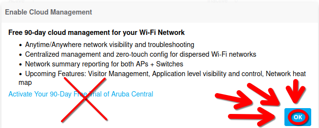
- You'll be soon directed to the dashboard. You now have access to the WebUI.

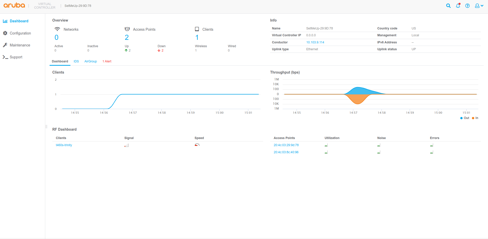

## **STEP 6:** Creating an SSID (Final Step)

| Step | Instruction | Image |
|---|---|---|
| 1. | Go to "Configuration > Networks." | 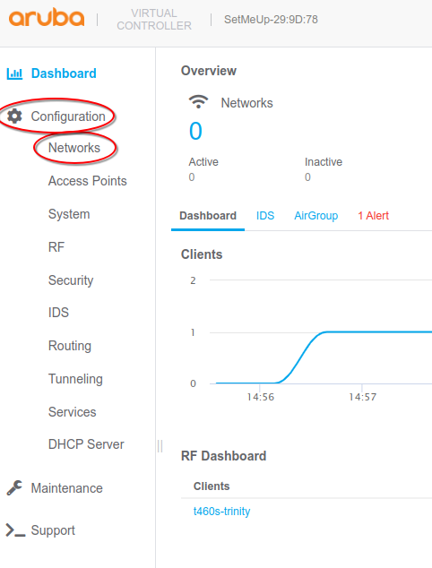 |
| 2. | Press the "+" button. | 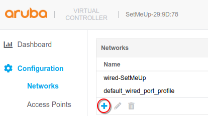 |
| 3. | Enter a unique SSID that you can easily identify. Your last name followed by `-LAB` in capital letters is recommended. Proceed by clicking the "Next" button. | 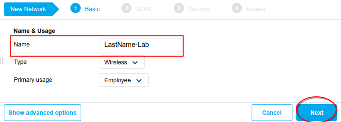 |
| 4. | Ensure your Client IP & VLAN Assignment has the following details before continuing. | 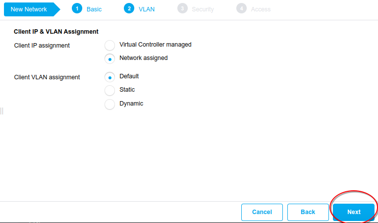 |
| 5. | Enter the password `Buckman-233` into the password field. Retype the password in the field below, then proceed. | 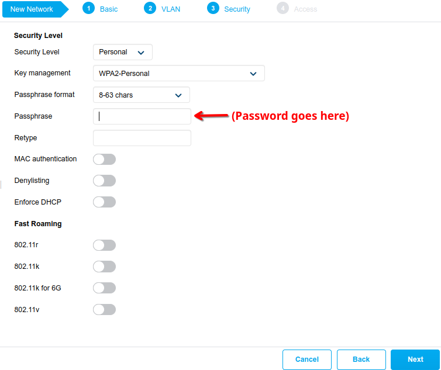 |
| 6. | Ensure your Access Rules have the following details before continuing. Click "Finish" | 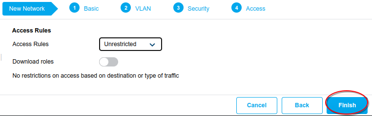 |

## Results

You should have an SSID that is operable and visible to wireless connections.

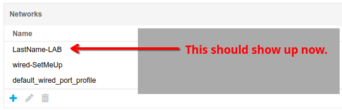

Take a picture of the `Configuration > Networks` screen for your lab report. You can take a screenshot or take a picture with your phone.

## Troubleshooting

<!-- ### Can't Connect to the AP

Check if your AP is [powered on](#powering-the-device) and connected to the appropriate PoE Ethernet cable. If not, [that's its own problem.](#the-ap-isnt-powering-on) -->

### The AP Isn't Powering On

If you LED of the AP isn't on, make sure that the cable is connected to the appropriate port as [previously practiced.](#step-1-powering-the-access-point)

If it's still not powering on **and your cable is connected to the appropriate port,** your Ethernet cable may not be connected to a PoE switch. Contact your instructor or borrow another PoE Ethernet cable somewhere else.

### The AP Keeps Looping Over and Over Again

Not much can be done about this other than to [factory reset it.](#step-3-factory-reset) If it's still looping, revise the steps you're taking for the factory reset.

Ask the instructor for help if you've been stuck doing this for more than 8 minutes.

### I can't get the AP's IP Address

The AP might be unable to get an IP Address via DHCP. Probably due to your workstation. Ask the instructor for assistance and possible relocation immediately.

### "Internal error 8-0, please contact support"

Attempting to log into an Aruba Access point with outdated, improper, or outright cursed firmware may result in your AP becoming completely inaccessible. There's nothing you can do here.

If you see this error, **ask the instructor for another AP immediately.**