# Lab: Adding Multiple SSID's on an Aruba Access Point

## Objective

To learn how to add multiple SSID's on an Aruba Access point.

## Expected Time to Complete

15-25 minutes. 2 minutes to physically set up the AP. 2 minutes for the AP to boot. 1-2 minutes to access the WebUI. 10-18 minutes to create and connect to the SSIDs.

## Preface

This lab assumes you know how to preform the following from previous labs.

| Action | Lab Source | Section |
|---|---|---|
| Power on the Access Point. | (Lab: Initial configuration / Factory Reset with One SSID) | Step 1 |
| Get the Access Point's IP from the console. | (Lab: Initial configuration / Factory Reset with One SSID) | Step 4 |
| Enter the Access Point's WebUI | (Lab: Initial configuration / Factory Reset with One SSID) | Step 5 |
| Create an SSID | (Lab: Initial configuration / Factory Reset with One SSID) | Step 6 |

This is not necessarily an "easy" lab. However, it is a short one. This lab is built on the previous lab about configuring access points, so all instructions involving WebUI navigation will be terse.

For your sake, you should have a phone or laptop with Wi-Fi connectivity with you. This is not required, but being able to connect to SSIDs by yourself to verify they work will save you a headache later in the lab.

## **STEP 1:** Setting Up a Guest SSID (Acknowledged)

A guest SSID is a public SSID that any user can connect to. They are typically found in fast food restaurants, cafés, or other public locations offering free Wi-Fi.

For this step, an incredibly basic guest SSID will be created.

| Step | Instruction | Image |
|---|---|---|
| 1. | Enter the AP's dashboard and go to `Configuration > Networks`. | 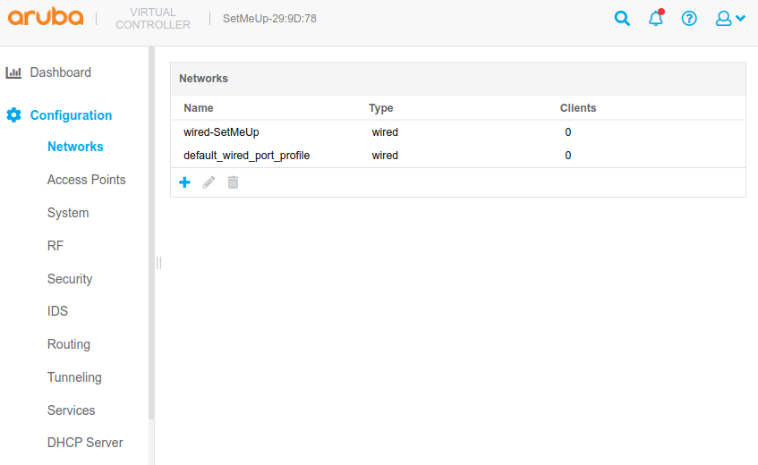 |
| 2. | Begin creating a new network. Set primary usage to `Guest`. Set the name to LastName-Lab-Guest-Ack. Replace *LastName* with your actual last name. Continue. | 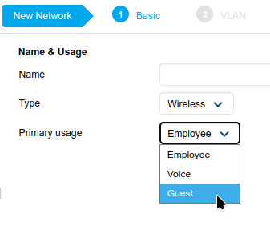 |
| 3. | Click "Next" and continue. | 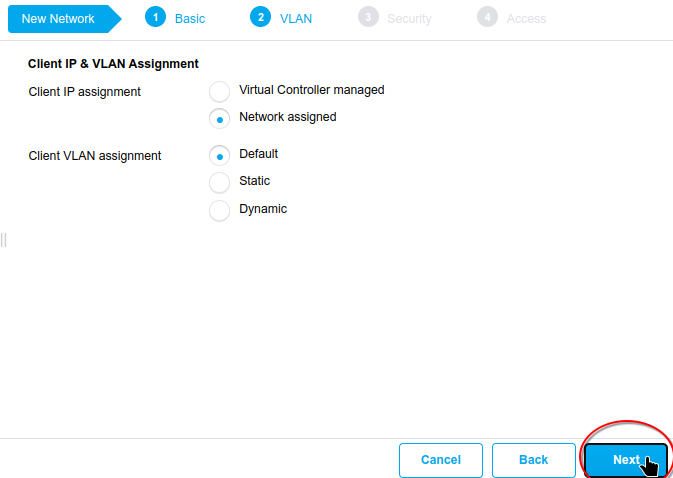
| 4. | This is a guest SSID's "Security" tab. [Step 2](#step-2-setting-up-a-guest-ssid-authenticated) will involve more set up here. For now, continue by pressing "Next." | 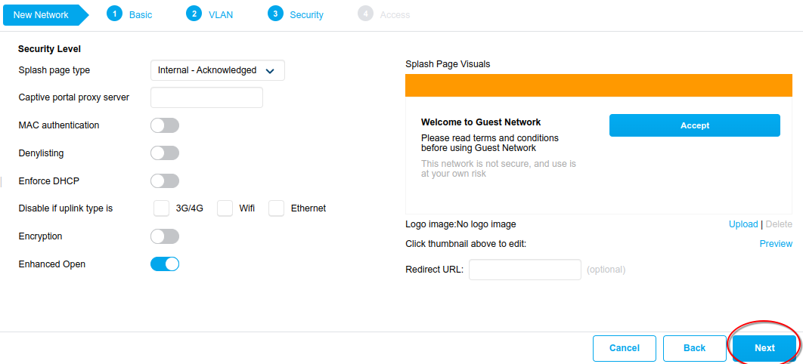
| 5. | Click "Finish." | 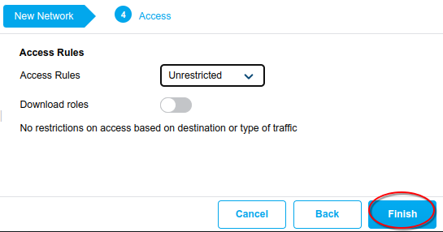 |

If everything was preformed correctly, you should be able to see your SSID appear as an accessible Wi-Fi network, as shown here: 

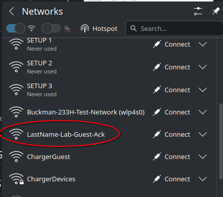

Connecting to the SSID should show the splash page. If you see this, it is working. You can move on now.

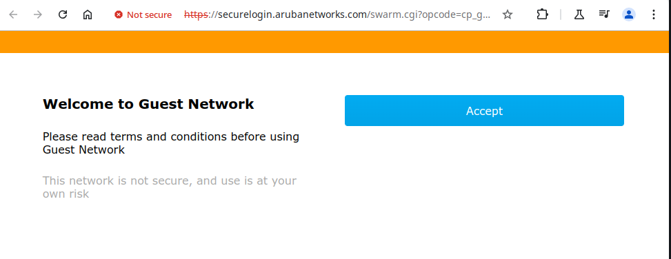

> | 🛈 Info |
> |---|
> | When attempting to access the guest SSID, your browser may warn you that the "connection is insecure." Ignore it and proceed. If you don't know how to, look [here.](#my-browser-is-telling-me-my-ssids-connection-is-insecure-the-big-red-warning-sign-scares-me-what-do-i-do) |

## **STEP 2:** Setting Up a Guest SSID (Authenticated)

You will be setting up another guest SSID. This time, it will require a username and password to get through the splash screen.

| Step | Instruction | Image |
|---|---|---|
| 1. | Repeat steps 1-3 in [STEP 1: Setting Up a Guest SSID](#step-1-setting-up-a-guest-ssid-acknowledged)
| 2. | Select "Splash Page Type" from `Internal: Acknowledged` to `Internal: Authenticated`. |  |
| 3. | Create a new user for the authentication server. Leave the type as "Guest." | 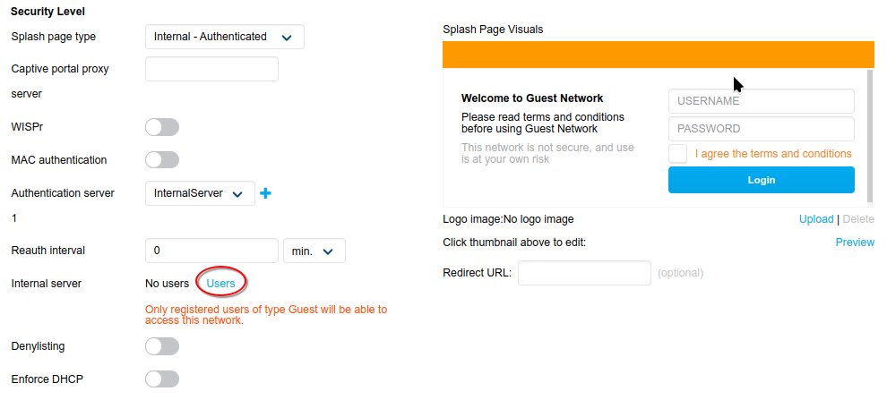 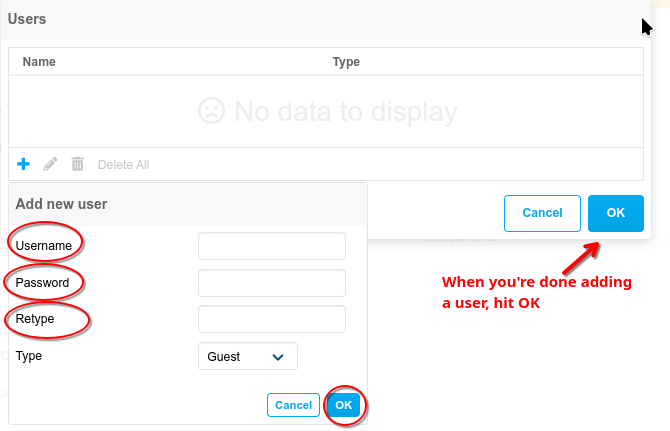 |
| 4. | Click "Finish." |  |

Like before, log into the SSID you just created. This time, enter the username and password you've created before.

> | 🛈 Info |
> |---|
> | If you forgot the username and password, edit the SSID (click on the pencil when selecting it on the *Networks* screen), then review and/or change your info. |

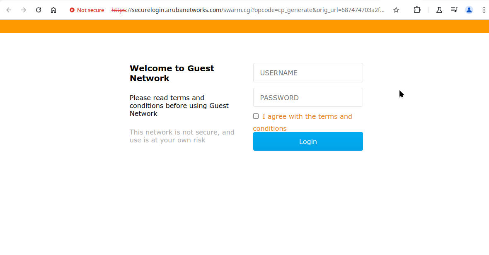

## **STEP 3:** Setting Up an WPA2-Enterprise SSID

| Step | Instruction | Image |
|---|---|---|
| 1. | Begin creating a new network. Set primary usage to `Guest`. Set the name to LastName-Lab-Guest-Ack. Replace *LastName* with your actual last name. Continue. | 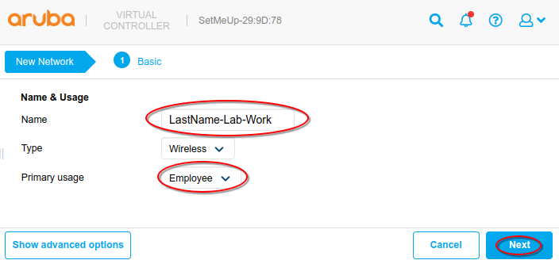 |
| 2. | Enter the VLAN tab and click "Next." | 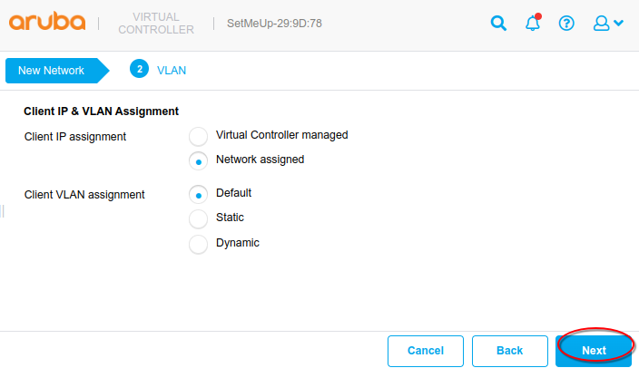 |
| 3. | Enter the Security tab. Select the **Enterprise** security level. | 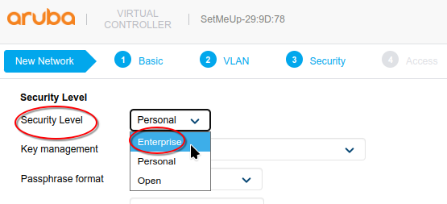 |
| 3a. | Begin creating a new user by selecting the "Users" link as shown in the image. | 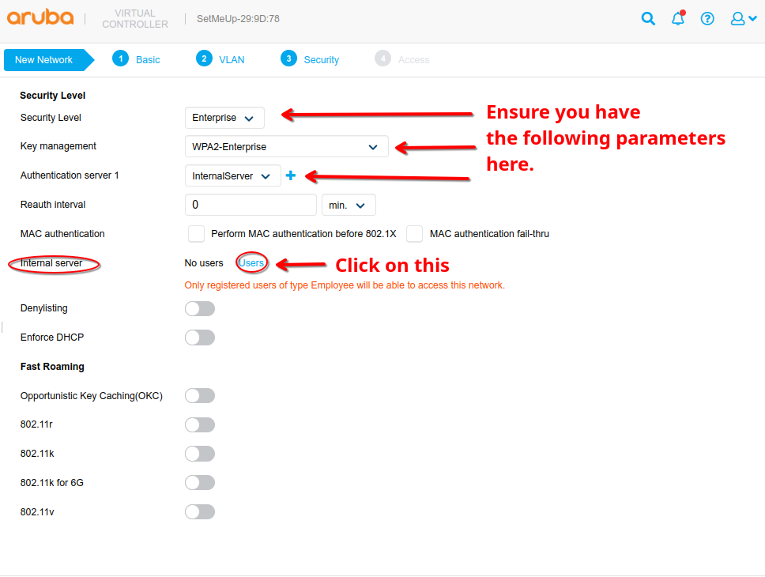 |
| 4. | Enter a new user just like in [STEP 2: Setting Up a Guest SSID (Authenticated)](#step-2-setting-up-a-guest-ssid-authenticated). Set the user's type from **Guest** to **Employee** | 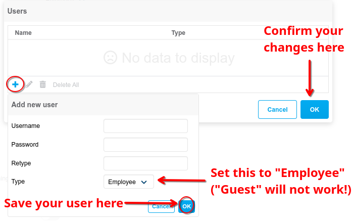 |
| | | 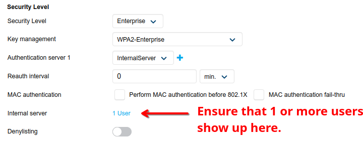 |
| 5. | Click next to progress to the last screen. | 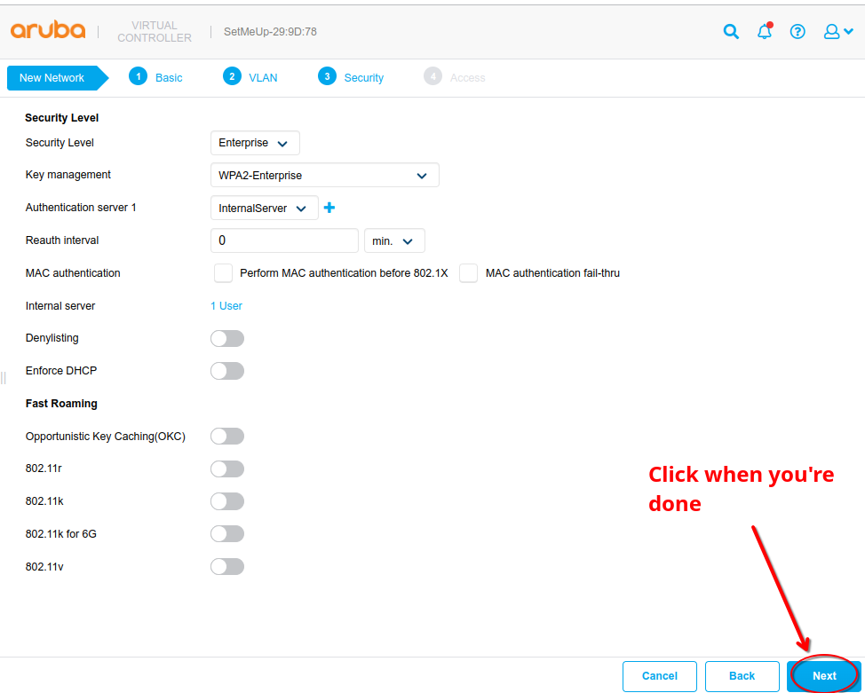 |
| 6. | Click "Finish." | 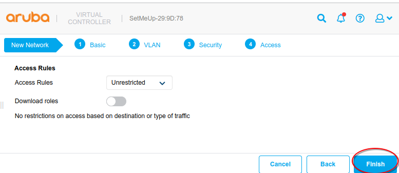 |

Log into the SSID you just created. Enter the username and password you've created before. See if you can get in. Remember to give the AP some time to properly broadcast your new SSID.

## Results

Show your networks in the Configuration/Networks menu and the Dashboard/Networks menu. Screenshot it and send it to the professor.

| Label         | Image                               |
| ------------- | ----------------------------------- |
| Example 1     | 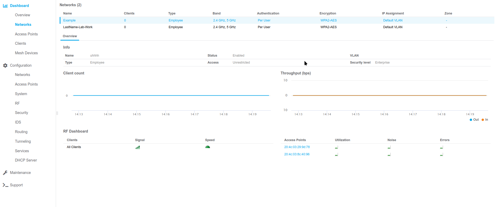 |
| Example 2     |         |

## Troubleshooting

### "I can't connect to the guest SSIDs even though I did everything right."

**After reconfiguration, an access point's networks will go down to update after a couple of minutes.** Give it some time and then try again. Work on another SSID while you wait.

You can check how many networks are open by going to the Dashboard's overview. Here is an example of networks that are ALL up:

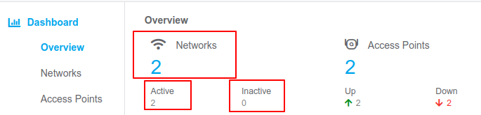

If you're still having trouble, disable the **Enhanced Open** option (found in the Security tab) with the SSID(s) you're having issues with. Then try again.

You can do this by editing the SSID after its creation. Future guest SSIDs shouldn't have Enhanced Open enabled if you have issues testing it.

### "My browser is telling me my SSID's connection is 'insecure.' The big red warning sign scares me. What do I do?"

When attempting to access the SSID on your desktop, your browser may warn you that the "connection is insecure." This is because the certificate for our AP is invalid. This is perfectly fine for your lab.

Ignore it and proceed. Click on the "Advanced" button and then "Proceed Anyway." You may have to do this 2 or 3 times.

This is different for every browser. The image above is an example for Chrome browsers and their derivatives, but different browsers have different screens for this. For example, Firefox's mobile browser might tell you to "try again" instead of going "back to safety." Don't select that either. Find any option that lets you continue. If you don't know how, look up how to or consult your instructor for help.