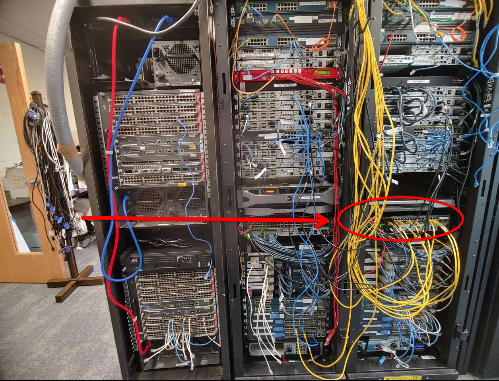
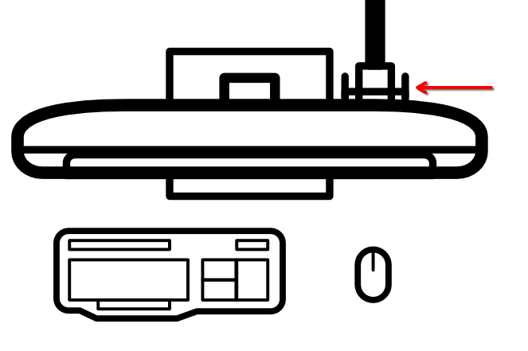
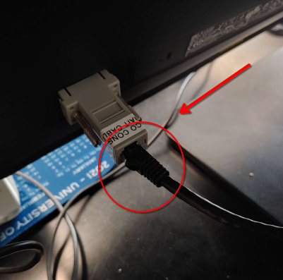

# Workstation Setup

## Overview

Your various labs will require the following equipment.

| Item | Image
|-|-|
| An Aruba Access Point | |
| A Workstation with a label. (A-I) | |
| A black PoE Ethernet cable that comes with the workstation. | |
| A PoE switch with a free port. | |

## Setting up your PoE Cable

Your PoE cable is necessary to power and connect to your Access Point. Before you can use it for your labs, you will need to set it up by preforming the following:

1. Connecting your assigned PoE cable to a PoE switch.
2. Disconnecting the black PoE cable from your workstation.

### 1. Connecting your **PoE Cable** to a **PoE Switch**

> | 🛈 Info |
> |---|
> | Difficulty with this part of the setup is **expected.** If you have any trouble getting your PoE switch connected, reach out for assistance **immediately.** |

You will be connecting your **PoE cable** to a single **PoE switch.** However, in order to do so, you will need to find the right cable that's assigned to your workstation.

Look in the bottom left corner of your workstation's desktop. You will see blue tape attached with a silver number written on it.

### 2. Connecting your **PoE Cable** to your **Access Point**

You should be able to find the other end on the back of your workstation.

|  |  |
|-|-|

Take this cable out of your workstation and plug it into your Access Point as such:
